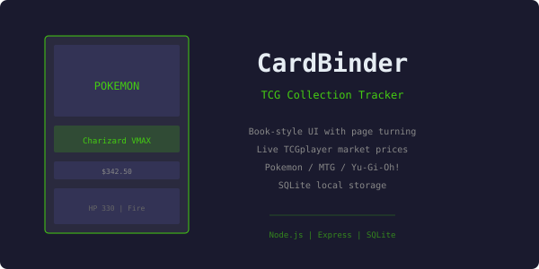
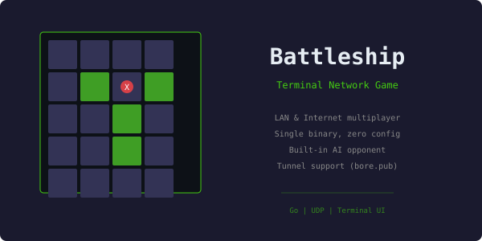
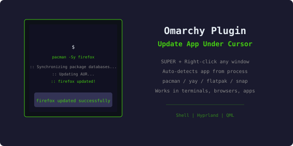
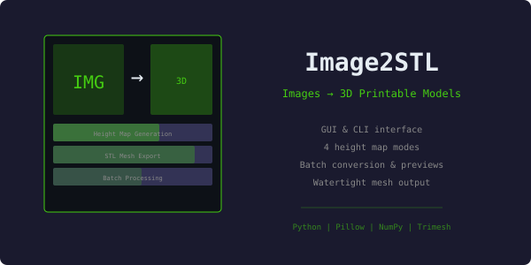
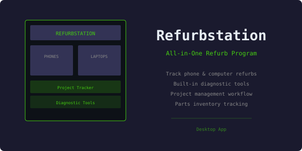
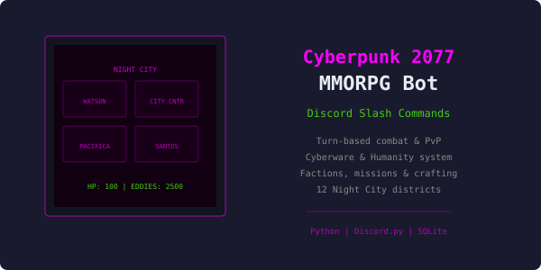

> I am a 42 year old IT Professional/Programmer that loves to create plugins for Linux (specifically Omarchy).

  
  
  

---

## 

---

## 

<table>
  <tr>
    <td align="center" width="50%"></td>
    <td align="center" width="50%"></td>
  </tr>
  <tr>
    <td align="center" width="50%"></td>
    <td align="center" width="50%"></td>
  </tr>
  <tr>
    <td align="center" width="50%"></td>
    <td align="center" width="50%"></td>
  </tr>
</table>

---

## 

-  Omarchy plugins & tools
-  Full-stack projects
-  Community bots & games
-  Image-to-STL conversion

---

## 

---

## 

---

## 

